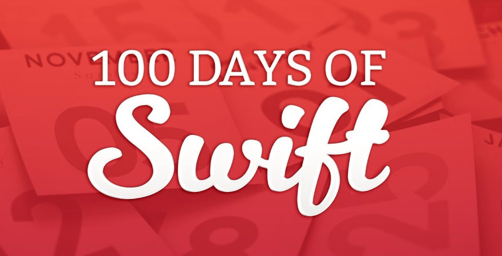
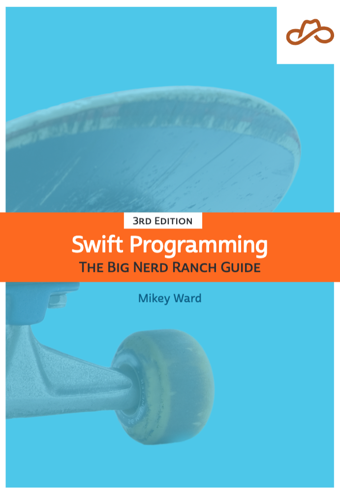

# 100 Days of Swift

In this repo, I wil share my progress of learning swift. The Challenge made by the owner of [Hacking With Swift](https://www.hackingwithswift.com/ "The Website Of Hacking With Swift") [Paul Hudson](https://twitter.com/twostraws "Paul's twitter account"). But, I took the challenge further, at the same time I will learn from another resource. [Swift Programming: The Big Nerd Ranch Guide, Third Edition](https://bignerdranch.com/blog/now-available-swift-programming-the-big-nerd-ranch-guide-third-edition/ "The Book's website"). Both of them have same curriculum but the book more detailed. I hope the 100 days would be a great days 😃. wish me luck.

## Resources

        
        
    

